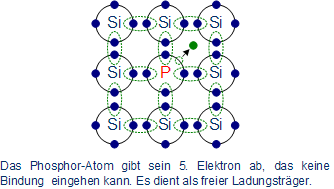
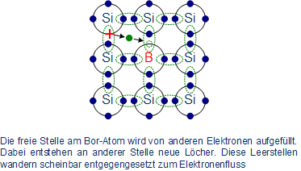
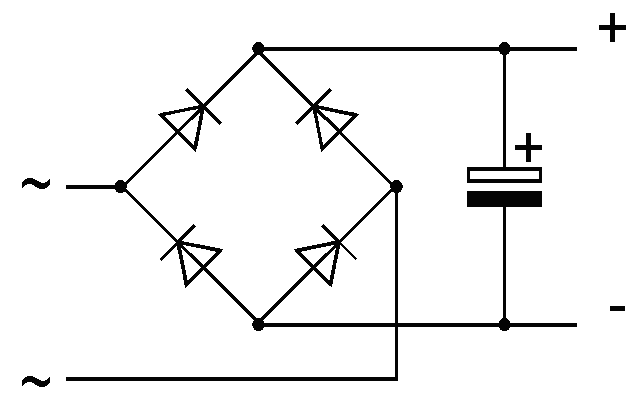

Halbleiter

# Halbleiter

Halbleiter werden meistens aus Silizium (Si) hergestellt. Silizium besitzt 4 Elektronen auf der Außenschale (8 auf Außenschale). Somit ist Silizium nicht leitfähig. Jedes Siliziumatom hat 4 Nachbaratome in einem Kristallgitter. Da somit alle Atome besetzt sind, kann kein Strom fließen.

## Dotierung

### n-Dotierung

Dotierung geschieht durch Einbringung von Fremdatomen. Ein beliebtes Element dafür ist Phosphor (P) mit 5 Außenelektronen. Bei der n-Dotierung wird immer ein Atom mit mehr Elektronen auf der Außenschale eingebracht.

Durch die Dotierung wird das Silizium leitfähiger.

### p-Dotierung
Bei der p-Dotierung werden Atome eingebracht, die auf der Außenschale ein Atom weniger haben als das Silizium (z.B. Bor).

### Zusammenspiel von n- und p-Dotierung

Wenn n- und p-Dotierte Stücke zusammengebracht werden, wandern die Elektronen aus der Grenzschicht vom n dotierten Stück zum p dotierten. Somit wird p negativ, n positiv geladen.

Die freien Stellen in der p- dotierten Schicht werden an dem Übergang mit den freien Elektronen aus der n- dotierten Schicht gefüllt. Es kann dann kein Strom fließen, da die freien Plätze in der p- dotierten Schicht besetzt sind. Es entsteht eine Sperrschicht.

Wird der + Pol an der n- dotierten Schicht angelegt, fließt kein Strom, da die Sperrschicht vorhanden ist. Da die freinen Plätze in der p- dotierten Schicht gefüllt werden durch die freiene Elektronen des - Pols und in der n- potierten Schicht die freien Elektronen zum - Pol wandern, vergrößert sich die Sperrschicht sogar. 

Wird der - Pol an die n- dotierte Schicht angelegt, weden die Elektronen in der p- dotierten Schicht vom + Pol angezogen. Die Sperrschicht wird aufgehoben und es kann Strom fließen.

Die Diode nutzt genau dieses Prinzip. Sie lässt den Strom nur in eine Richtung fließen.

### Anwendung

Beim Gleichrichter erden 4 Dioden entgegengestzt geschaltet. Wird eine Wechselspannung angelegt, entsteht wie dargestellt ein + und ein - Pol.

## Transistor