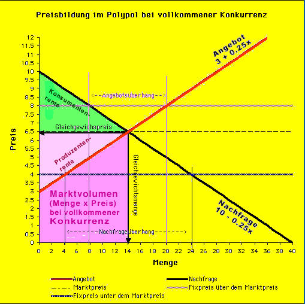

Angebot & Nachfrage

# Angebot & Nachfrage

## Bestimmungsgrößen Nachfrage

Nachfrage setzt sich zusammen aus:
- Bedarfsstruktur, Interesse
- Preis des nachgefragten Gutes
- Preis anderer Güter (Substitutionsgüter, die andere erstezen & Komplementärgüter, die andere ergänzen)
- Verfügbarkeit
- Qualität, Ausstellung
- Kosumsumme
- Zukünftige wirtschaftliche/technische Entwicklung

## Bestimmungsgrößen Angebot

- Kosten der Produktionsfaktoren
- Erwartete Nachfrage & Gewinnerwartungen
- Verfügbarkeit
- Maximale Produktionsmenge
- Angebotspreise der Konkurenz
- Markteintrittsschwelle
- Qualität & Stand des technischen Fortschritts

## Preisbildung

| Produzenten Mindespreis | Produzenten Menge | Konsumenten Höchstpreis | Konsumenten Menge |
| - | - | - | - |
| 370€ | 1500 | 460€ | 1000 |
| 400€ | 2000 | 430€ | 1000 |
| 430€ | 1000 | 400€ | 1500 |
| 460€ | 500 | 370€ | 2000 |

| Preis | Produzenten Anzahl | Konsumenten Anzahl | Realisierte Menge |
| - | - | - | - |
| 370€ | 1500 | 5500 = 2000 + 1500 + 1000 + 1000 | 1500 |
| 400€ | 3500 = 2000 + 1500 | 3500 = 1500 + 1000 + 1000 | 3500 |
| 430€ | 4500 = 1500 + 2000 + 1000 | 2000 = 1000 + 1000 | 2000 |
| 460€ | 5000 = 1500 + 2000 + 1000 + 500 | 1000 | 1000 |

## Funktionen des Preises

- Ausgleichsfunktion: Ausgleich von Angebot und Nachfrage
- Signalfunktion: Steigender Preis = Gut ist relativ knapp, sinkender Preis = Gut ist relativ weniger knapp
- Lenkungsfunktion: Ein Unternehmen einer Branche wechselt aufgrund der niedrigen Gewinne dort in eine andere Branche
- Erziehungsfunktion: Preis erzieht Anbieter zu Kostensenkung, Nachfrager zu Preisvergleich