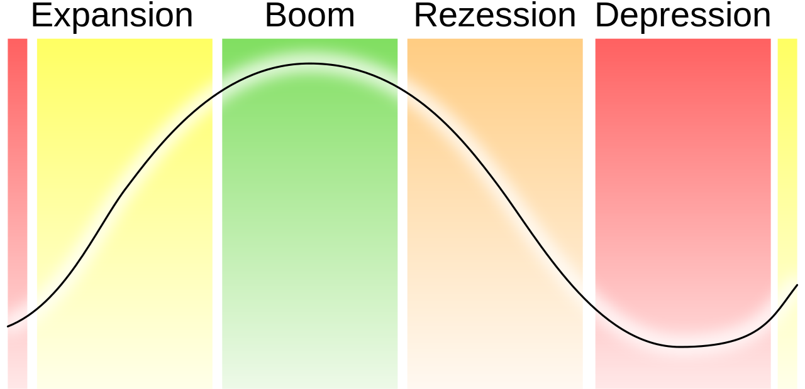

Grundzüge staatlicher Wirtschaftspolitik

# Grundzüge staatlicher Wirtschaftspolitik

## Formen

- Planwirtschaft: Wirtschaft wird von Staat geplant (z.B. in sozialistischen Staaten)
- Soziale Marktwirtschaft: Staat greift ein, um soziale Gesichtspunkte zu kontrollieren (z.B. Deutschland)
- Freie Marktwirtschaft: Staat greift nicht in die Wirtschaft ein

## Magisches Viereck (/Sechseck)

Stabilitäts und Wachstumsgesetz:
§1 : Gesamtwirtschaftliches Gleichgewicht (alle Produktionsfaktoren sind voll beschäftigt und alle Märkte gleichen sich aus)

Grundpfeiler des magischen Vierecks (Staatliche Interessen):

Qualitative Ziele:
- Außenwirtschaftliches Gleichgewicht: Wird gemessen am Außenhandelssaldo. 1-2 % des Pruttosozialprodukts sind ideal (Deutschland 2018: 6,8%)
- Stetiges und angemessenes Wirtschaftswachstum: Gemessen am Bruttinlandsprodukt (Wert aller Waren und Dienstleistungen, die in einem Jahr innerhalb der Landesgrenzen einer Volkswirtschaft produziert werden). (Deutschland 2018: 3.300 Mrd. €)
- Hoher Beschäftigungsstand: Gemessen an der Arbeitslosenquote (Deutschland April 2018: 4,9%)
- Preisniveaustabilität: Gemessen an der Inflationsrate (Deutschland April 2018: 2,0%)

Quantitative Ziele:

- Gerechte Einkommens- und Vermögensverteilung
- Umweltschutz

## Kunjunktur

Die Kunjunktur ist die gesamtwirtschaftliche Lage. Es gibt verschiedene Phasen:

Instgesamzt ist ein Aufschwung der wirtschaftlichen Lage mit den Phasen zu beobachten.

| | Aufschwung (Expansion) | Boom | Abschwung (Rezession) | Depression |
| - | - | - | - | - |
| Beschäftigung | Steigend | Stabil am höchsten | Sinkend | Stabil am niedrigsten |
| Auftragseingang | Steigend | Stabil am höchsten | Sinkend | Stabil am niedrigsten |
| Zinsniveau | Steigend | Stabil am höchsten | Sinkend | Stabil am niedrigsten |
| Konsumneigung | Steigend | Stabil am höchsten | Sinkend | Stabil am niedrigsten |

### Konjunkturindikatoren

#### Frühindikator

- Auftragseingänge bei Unternehmen
- Kreditzusagen
- Investitionsvolumen
- Geschäftserwartung von Unternehmen
- Baugenehmigungen im Hochbau

#### Präsenzindikator (gleichlaufende Indikatoren)

- Veränderung des BIP
- Ausmaß Kurzarbeit
- Investitionsvolumen
- Kapazitätsauslastung
- Produktionsindizes

#### Spätindikatoren

- Arbeitslosenquote
- Ausmaß Kurzarbeit
- Preisundizes

### Ifo-Geschäftsklimaindex

Mit dem Ifo-Geschäftsklimaindex des Institus für Wirtschaftsforschung (ifo) lassen sich Wendepunkte in der Konjunktur vorhersagen. Ein Aufschwung kann etwa 2 bis 3 Monate vorher, ein Abschwung 4 Monate vorher bestimmt werden. Für den Index werden 7000 Unternehmen des verarbeitenden Gewerbes, des Bauhauptgewerbes, des Großhandles und des Einzelhandels befragt zu ihrer aktuellen Geschäftslage (gut/befriedigend/schelcht) und ihren Erwartungen für die nächsten sechs Monate (günstiger/gleichbleibend/schlechter). Die ANtworten werden nach Bedeutung der Branche gewichtet, zusammengefasst und auf Basis  dieser Daten der Ifo-Geschäftsklimaindex ermittelt.

## Konjunkturpolitik

| Vertreter | Angebototsorientierte Wirtschaftspolitik | Nachfrageorientierte Wirtschaftspolitik |
| - | - | - |
| Vertreter | Milton Friedman | J.M. Keynes |
| Rolle des Marktes | Markt bringt sich von selbst ins Gleichgewicht | Selbsthilfekräfte des Marktes reichen nicht aus |
| Rolle des Staates | Staat sorgt nur für gute Rahmenbedingungen für Markt z.B. Steuerentlastungen | Staat beinflusst Markt, Nachfrage soll vom Staat gefördert werden, Rücklagen bei guter Konjunktur bilden (antizyklisch) |
| Probleme | Nur bei Vollbeschäftigung möglich und wenn Bund und Länder gemeinsam arbeiten, soziale Aspekte fallen aus | Staatsverschuldung steigt, zeitliche Reaktion nur schwer möglich, Politik braucht lange für Rektion, Umfang des Konjunkturprogramms nicht bestimmbar |- [ ] Listeneintrag